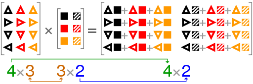

```{r setup, include=FALSE, error=TRUE, message=FALSE}
knitr::opts_chunk$set(echo = TRUE, comment = NA, error = TRUE)
```

## Scalar Multiplication

It uses the R `*` operator.

```{r}
a <- c(1, 2)
b <- c(-1, 0)

a * b
```

The multiplication is element-wise and the result is anther vector;

Let's try another vector:

```{r}
a3 <- c(1, 2, 3)
b3 <- c(5, -1, 1)

a3 * b3
```

## Dot Product in R
In mathematics, the dot product or scalar product[1] (sometimes inner product in the context of Euclidean space, or rarely projection product for emphasizing the geometric significance).

In R the _dot product_ is performed by the function `crossprod`.


```{r}
crossprod(a, b)
```

```{r}
crossprod(a3, b3)
```

The dot-product is a scalar not a vector.

```{r}
d <- c( 1, 3, 5)
e <- c(1, 2, 3)

crossprod(d, e)
```

### properties of dot product

The dot product of two Euclidean vectors $\mathbf a$ and $\mathbf b$ is defined by:

$\mathbf {a} \cdot \mathbf {b} =\|\mathbf {a} \|\ \|\mathbf {b} \|\cos(\theta )$,

where $\theta$ is the angle between $\mathbf a$ and $\mathbf b$.

So, if $\mathbf a$ and $\mathbf b$ are orthogonal, then $\theta$ is 90 degrees.

Therefore,

 $\mathbf a \cdot \mathbf b = 0$


```{r}
f <- c(2, 4, 6)
e <- c(1, 2, 3)

crossprod(f, e)
```


## Matrix multiplication
It uses the `%*%` operator.

This will `a3 %*% b3` operation will give an error:
```{r}
a2 <- c(2, 4)
b3 <- c(5, -1, 1)
a2;b3
a2 %*% b3
```

But `b3 %*% a3` won't:
```{r}
b3 %*% a3
```

And that os because of the dimensions of the vectors.


This other example using matrices works.

```{r}
A <- matrix(1:6, nrow=2)
A
```


```{r}
B <- matrix(1:3, ncol=1)
B
```

$1*1 + 3*2 + 5*3 = 22$

$2*1 + 4*2 + 6*3 = 28$


```{r}
A %*% B
```


But if we multiply a matrix of lesser order, the multiplaction fails:
```{r}
B %*% A
```

## Graph explaining matrix multiplication



